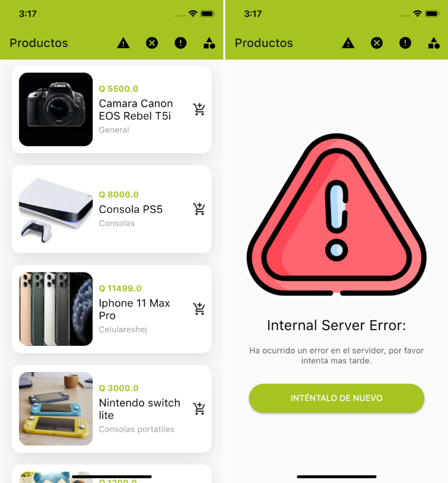
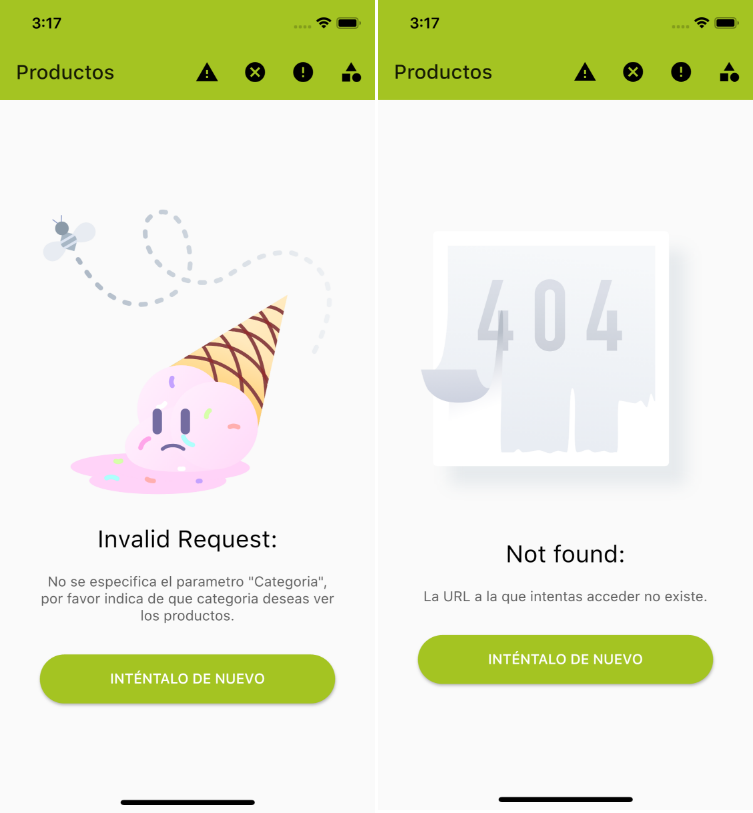

# REST API Practice

Proyecto para mostrar el uso de un API Rest durante el meeting de Flutter Guatemala, aprenderemos a consumir una API de productos que nos permite seleccionar su cimportamiento por medio de un codigo HTTP.

[Video de YouTube](https://www.youtube.com/watch?v=fAbySSpkuvA&ab_channel=FlutterGuatemala)

Tambien utilziaremos Provider para manejar los errores que nos puede dar una API






## Getting Started

```
flutter get packages
```
```
flutter run
```
